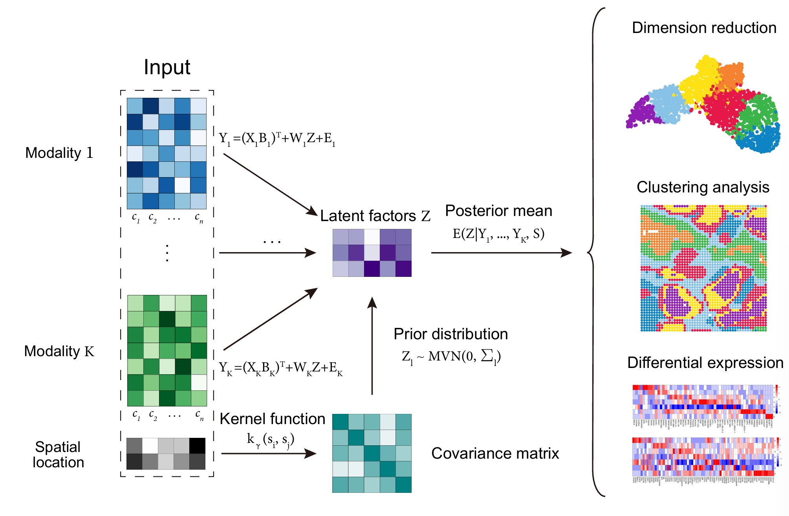

# Spatial Multi-Omics PCA

Spatial Multi-Omics PCA (SMOPCA) is a novel dimension reduction method to integrate multi-modal data and extract low-dimensional representations with preserved spatial dependencies among spots.

## Dependencies

python 3.10.0

scanpy 1.9.1

numpy 1.23.5

scikit-learn 1.2.1

scipy 1.10.0

h5py 3.8.0

## Run SMOPCA

1. Prepare the input normalized and log-transformed data matrices as numpy arrays and specify the dimension of the latent factors. The data arrays can come from various sources, such as h5 dataset, .csv file, etc.
   - Note that SMOPCA takes input matrices with columns corresponding to cells/spots.
2. Specify the type of kernel and the length_scale parameter, and build the kernel matrix.
   - For the kernel type parameter, we use matern kernel for all datasets included in our paper.
   - For the length_scale parameter, we set length_scale=0.25 for UMAP coordinates and length_scale=5 for simulated and real spatial coordinates.
   - For the rest of the parameters, see more in tutorials.
3. Perform inferencing and extract the latent representation.

## Downstream Analysis

SMOPCA outputs a joint latent representation of spatial multi-omics data which can be used for further downstream analyses:

1. Clustering analysis with specified method of clustering (KMeans recommended);
2. UMAP or t-SNE visualization with predicted or ground truth labels;
3. Differential expression analysis based on predicted cell type labels.